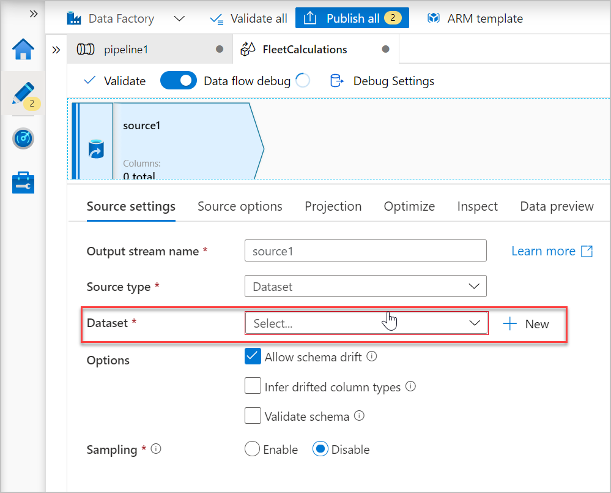
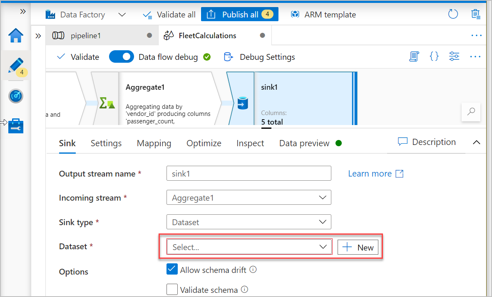
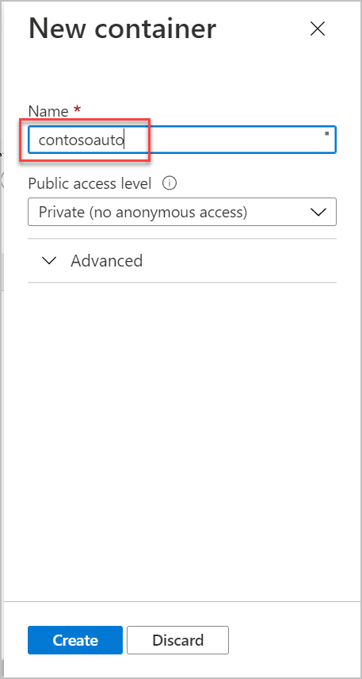

# Data & AI Tech Immersion Workshop – Product Review Guide and Lab Instructions

## Data, Experience 5 - Simplifying data flows with Azure Data Factory

- [Data & AI Tech Immersion Workshop – Product Review Guide and Lab Instructions](#data--ai-tech-immersion-workshop-%e2%80%93-product-review-guide-and-lab-instructions)
  - [Data, Experience 5 - Simplifying data flows with Azure Data Factory](#data-experience-5---simplifying-data-flows-with-azure-data-factory)
  - [Technology overview](#technology-overview)
  - [Scenario overview](#scenario-overview)
  - [Exercise 1: Using ADF Mapping Data Flows to visually configure data transformation pipelines](#exercise-1-using-adf-mapping-data-flows-to-visually-configure-data-transformation-pipelines)
    - [Task 1: Create the data flow](#task-1-create-the-data-flow)
    - [Task 2: Previewing the trip data](#task-2-previewing-the-trip-data)
    - [Task 3: Configuring the tripfare data source](#task-3-configuring-the-tripfare-data-source)
    - [Task 4: Join the data sources](#task-4-join-the-data-sources)
    - [Task 5: Create an aggregate](#task-5-create-an-aggregate)
    - [Task 6: Add the destination sink](#task-6-add-the-destination-sink)
    - [Task 7: Run the pipeline](#task-7-run-the-pipeline)
  - [Exercise 2: Execute an ADF Pipeline to copy data](#exercise-2-execute-an-adf-pipeline-to-copy-data)
    - [Task 1: Prepare the ADLS file system](#task-1-prepare-the-adls-file-system)
    - [Task 2: Using the Copy activity in Azure Data Factory](#task-2-using-the-copy-activity-in-azure-data-factory)
  - [Wrap-up](#wrap-up)
  - [Additional resources and more information](#additional-resources-and-more-information)

## Technology overview

A modern data warehouse lets you bring together all your data at any scale easily, and to get insights through analytical dashboards, operational reports, or advanced analytics for all your users.

1. Combine all your structured, unstructured and semi-structured data (logs, files, and media) using Azure Data Factory to Azure Blob Storage.
2. Leverage data in Azure Blob Storage to perform scalable analytics with Azure Databricks and achieve cleansed and transformed data.
3. Cleansed and transformed data can be moved to Azure SQL Data Warehouse to combine with existing structured data, creating one hub for all your data. Leverage native connectors between Azure Databricks and Azure SQL Data Warehouse to access and move data at scale.
4. Build operational reports and analytical dashboards on top of Azure Data Warehouse to derive insights from the data, and use Azure Analysis Services to serve thousands of end users.
5. Run ad hoc queries directly on data within Azure Databricks.

Mapping Data Flows in Azure Data Factory provide a way to transform data at scale without any coding required. You can design a data transformation job in the data flow designer by constructing a series of transformations. Start with any number of source transformations followed by data transformation steps. Then, complete your data flow with sink to land your results in a destination.

## Scenario overview

Like many organizations, ContosoAuto generates data from numerous system, each of which has its own location and format, including structured, unstructured, and semi-structured data. They would like the ability to combine and analyze these disparate datasets in order to gain actionable insights that can help them operate their business more efficiently.

In this experience, ​​you will see how you can use the capabilities of Azure Data Factory (ADF) to visually create data flows that read, transform and write data.

## Exercise 1: Using ADF Mapping Data Flows to visually configure data transformation pipelines

### Task 1: Create the data flow

1.  Browse to the Azure Portal and navigate to the `tech-immersion-XXXXX` resource group and select the Azure Data Factory instance `tech-immersion-df-XXXXX`.

    

2.  On the **Overview** blade, select **Author & Monitor**.

    

3.  Select the Author tab from the left hand side.

    

4.  On the Factory Resources panel, select **+** and then choose **Pipeline**.

    

5.  On the Activities panel, in the Search Activities text box type `data flow`.

    

6.  Drag the Data Flow entry that appears to the right on to the pipeline design surface and drop it.

    

7. In the Adding Data Flow panel, choose **setting**, select **Data Flow** and select **new**.

    

8. Populate the Data Flow Name field on the General tab with a value of `FleetCalculations`.

    

10. In the tool tip that appears, click **Finish**.

11. Select the **Add Source** area on the data flow design surface.

    

12. In the tool tip that appears, read the guide text and select **Next** until it is dismissed.

13. Near the top of the window, toggle the **Data Flow Debug** to on and then select **OK** in the dialog that appears. This will provision a small Databricks cluster behind the scenes that you will use to inspect your data as you are building the data flow. It takes about 5 minutes to be ready, but you can continue on with the next steps while it starts up.

    

14. Select the new source data set item, and then in the property panel, select the **Source Setting** tab, 

15. Select **+ New** next to _dataset_.

    

16. On the New Data Set panel, select **Azure Blob Storage** and then select **Continue**.

    

17. On the Select Format panel, select **DelimitedText** and select **Continue**.

    

18. On Set Properties, set the Name to `trip_data_input` and the under Linked service select `AzureBlobStorage`, which is a storage account that has been added for you.

    

19. On Set Properties, for the File Path configure the following values:

    - Container: `data`
    - File: `trip_data_1.csv`
    - First row as header: `checked`

    

20. Select **Finish**.

21. You now have your source CSV file configured in the data flow.

### Task 2: Previewing the trip data

1.  Check if the Data Flow Debug toggle has turned solid blue and shows a green dot. If it has your cluster, it is ready and you can continue. If not, please wait at this step until is ready before continuing.

    

2)  With `source1` still selected in the data flow designer, select Source Settings in the property panel and set the Output stream name to `tripdata`.

    

3)  In the property panel, select **Projection** and then select **Detect data type**. This will sample your data and automatically set the data type for each of the columns.

    

4)  The process will run for a few moments. When it completes Review the assignments in the table.

    

5)  You can preview the data output from any data flow node, by selecting that node in the designer and then selecting the **Data Preview** tab in the property panel and selecting **Refresh**.

6.  In a few moment the data preview will load with the preview of the output data for that node.

### Task 3: Configuring the tripfare data source

1.  In the Data Flow design surface, below tripdata, select **Add Source**.

    

2.  For the Output stream name provide `tripfare`, and then select + New to the right of Source dataset.

3.  On New Dataset, select **Azure Blob Storage** and select **Continue**.

4.  On Select Format, choose **DelimitedText** and select **Continue**.

5.  For Set Properties, for Name set it to `trip_fare_input`, for the Linked service select `AzureBlobStorage` and for the File Path provide the following and select **Finish**:

    - Container: `data`
    - File: `trip_fare_1.csv`
    - First row as header: `checked`

    

6.  With the tripfare node selected, in the property panel select **Projection** and then select **Detect data type** to set the schema for this data source.

    

7.  At this point you should have both the tripdata and tripfare data sources on the design surface.

    

### Task 4: Join the data sources

1.  Select the **+** on the bottom-right of the tripdata source and then select **Join**.

    

2.  In the property panel, under Join Settings, for Right stream select **tripfare**. Leave the Join type as `Inner`. For the Join conditions match up the fields as follows (click the **+** that appears when hovering over the condition row to add new condition):

    - hack_license : hack_license
    - medallion : medallion
    - vendor_id : vendor_id
    - pickup_datetime : pickup_datetime

    

### Task 5: Create an aggregate

1.  Select the **+** to the bottom-right of the Join1 node, and select **Aggregate**.

2.  On the property panel, under **Aggregate Settings**, select **Group By**. For Join1's columns select `vendor_id`.

3.  Select the **Aggregates** tab (to the right of **Group By**). Add the following aggregates (use the + that appears when hovering over each row to add another column):

    - passenger_count : round(sum(passenger_count), 2)
    - trip_time_in_secs : round(sum(trip_time_in_secs)/60, 2)
    - trip_distance : round(sum(trip_distance), 2)
    - TotalTripFare : round(sum({ total_amount}), 2)

    

> NOTE:  TotalTripFare is not a source column, so type its name rather than selecting it.

4.  At this point your data flow should look like the following:

### Task 6: Add the destination sink

1.  Select the **+** to the bottom-right of the Aggregate1 node, and select **Sink**.

2.  Select **Finish** on the tooltip that appears.

3.  With sink1 selected, on the property panel, select **+ New next** to _dataset_.

4.  On New Dataset, select **Azure Blob Storage** and select **Continue**.

5.  On Select Format, select **DelimitedText** and select **Continue**.

6.  For Set Properties, for Name set it to `vendorstats`, for the Linked service select `AzureBlobStorage` and for the File Path provide the following and select **Finish**:

    - Container: `data`
    - File: Leave blank

    

7.  Save your data flow and pipeline by selecting **Publish All**. It will take a few moments to publish.

    

### Task 7: Run the pipeline

1.  From the Factory Resources panel, select **pipeline1**.

    

2.  From the button bar select **Add trigger**, **Trigger Now** and then select **Finish** to execute your pipeline and the data flow it contains.

    

3.  Select **Monitor** from the menu tabs on the left. Watch the status of your pipeline as it runs. Select **Refresh** at any point to update the listing. It should take **about 7 minutes** to completely execute your pipeline.

4.  When the pipeline has completed, navigate to the `tech-immersion-XXXXX` resource group, select the `samplefiles` storage account and select **Blobs** and then the `data` folder.

    

5.  You should see a new file that is the output of your pipeline (one CSV file is output per partition of the data)!

    

## Exercise 2: Execute an ADF Pipeline to copy data

### Task 1: Prepare the ADLS file system

In this task, you will set up your ADLS Gen2 filesystem, and then review and execute ADF pipelines to copy data from various sources, including Cosmos DB, in your ADLS Gen2 filesystem.

1. In a web browser, navigate to the [Azure portal](https://portal.azure.com), select **Resource groups** from the left-hand menu, and then select the resource group named **tech-immersion-XXXXX** resource group (where XXXXX is the unique identifier assigned to you for this workshop).

   

2. Prior to using ADF to move data into your ADLS Gen2 instance, you must create a filesystem in ADLS Gen2. Within the resource group, select the storage account whose name like `adlsstrgXXXXX`.

3. On the Overview blade, look under services and select **containers**.

   

4. Select **+ container** and in the dialog that appears enter `contosoauto` for the name of the container and select **OK**.

   

### Task 2: Using the Copy activity in Azure Data Factory

1.  Switch back to the Azure Data Factory Author page.

2.  On the ADF Author page, select **Pipelines** to expand the list, and then select the **CopyData** pipeline from the list.

    

    > The `CopyData` pipeline consists of three copy activities. Two of the activities connect to your Azure SQL Database instance to retrieve vehicle data from tables there. The third connects to Cosmos DB to retrieve batch vehicle telemetry data. Each of the copy activities writes data into files in ADLS Gen2.

3.  On the pipeline toolbar, select **Add Trigger**, then select **Trigger Now**, and then select **Finish** on the Pipeline Run dialog. You will receive a notification that they `CopyData` pipeline is running.

4.  To observe the pipeline run, select the **Monitor** icon from the left-hand menu, which will bring up a list of active and recent pipeline runs.

    

    > On the pipeline runs monitor page, you can see all active and recent pipeline runs. The **Status** field provide and indication of the state of the pipeline run, from In Progress to Failed or Canceled. You also have the option to filter by Status and set custom date ranges to get a specific status and time period.

5.  Select the **Activity Runs** icon under Actions for the currently running pipeline to view the status of the individual activities which make up the pipeline.

    

    > The **Activity Runs** view allows you to monitor individual activities within your pipelines. In this view, you can see the amount of time each activity took to execute, as well as select the various icons under Actions to view the inputs, outputs, and details of each activity run. As with pipeline runs, you are provided with the Status of each activity.

## Wrap-up

In this experience, ​​you used Azure Data Factory (ADF) and the Copy Activity to move data from Azure SQL Database and Cosmos DB into Azure Data Lake Store Gen 2. You also used mapping data flows to create a data processing pipeline using the visual designer.

## Additional resources and more information

To continue learning and expand your understanding use the links below.

- [Azure Data Factory documentation](https://docs.microsoft.com/en-us/azure/data-factory/)
